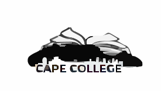

  

# GANU-project
Organization Info 2024

# Project Outline
    1. Project Scope and Introduction
    2. BRD review
    3. App Development
    4. Functionality
    5. Feedbanck and future improvements
# Project Overview
    The Cape College Administration System is a new system that seeks to manage the student database more effectively by the use of Information Management Systems. The system will be able to do the the 4 basic components of Information System; capture, store, analyse and present the data. This will assist the Institution's planning for future events by looking at the previous trends presented by the data.
    
    There are proposed adjustements in the current administration process. These adjustment are made enable the user with an easy and convenient access the system. User's will be assigned access based on hierarchal structure. The BRD use cases will provide information about accesses of the users involved in the system. Actvity diagrams provide the actvity of the system with the users; Then the class daiagram provides the over view and data 
# Introduction
    Cape College is a small local college in the City of Cape Town. 
    Cape College offers consist of 6 faculties with a total of 24 courses 
    available and 98 subjects offered. Cape College have been 
    going through difficulties during the registration period. They had difficulties with future planning to equip their selves with issues that may be faced on the coming year.

    There is a need to modernize the student administration system. This system 
    must be developed using modern web technologies and methodologie. This will 
    allow the institution management to manage their database more, less human error, be able to draw trends.

