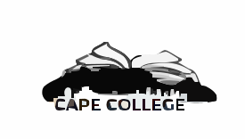

  

# GANU-project
Organization Info 2024

# Project Outline
    1. Project Scope and Introduction
    2. BRD review
    3. App Development
    4. Functionality
    5. Feedbanck and future improvements
# project Overview
    The Cape College Administration System is a new system. It has been created to enhance the capacity to be able to capture, store and analyze data with little effort and securely. UML diagrams will present how the system will function.

# Introduction
    Cape College is a small local college in the City of Cape Town. Cape College offers consist of 6 faculties with a total of 24 courses available and 98 subjects offered. Cape College have been going through difficulties during the registration period and they found it hard to manage and administer their student in the traditional system that they have been using.
    There is a need to modernize the student administration system. This system must be developed using modern web technologies and methodologies.  This will allow the management and administrators of the institution to manage student and staff information easily. The institution will be able to run analysis to better their learning experience and other issues that need analysis.
